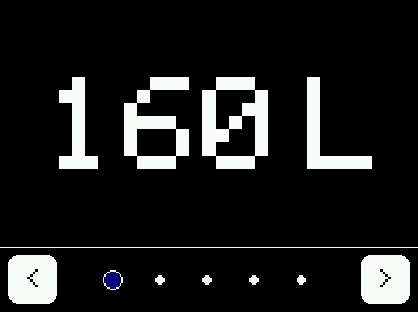
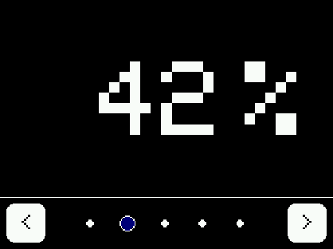
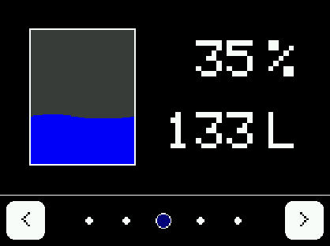
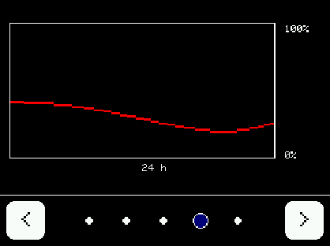
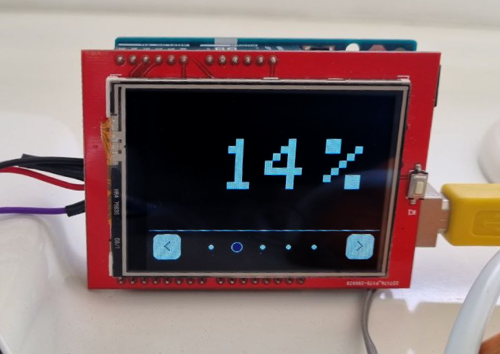

# Water Tank Display


A feature-rich water tank display using a 2.4" TFT touchscreen display, an Arduino Uno, and an ultrasonic sensor.

Currently, you can use the touch screen to rotate through the following screens:

## Screens

| Screen | Description | Image |
| --- | --- | --- |
| Liter | Displays the current water level in liters |  |
| Percentage | Displays the current water level in percentage |  |
| Combined | Displays the current water level in liters and percentages. Additionally, it shows a tank graphic with the current water level and animated waves! |  |  |
| Plot | Displays a live updating plot of the water level over time |  |

## Features

- [x] Display the water level in liters
- [x] Display the water level in percentage
- [x] Combined dashboard with animated waves
- [x] View the water level over the last day
- [x] Touch screen interface
- [x] Persistent page selection (survives power cycles)
- [x] Serial raw data output
- [x] Configurable tank size

## Hardware

- Arduino Uno
- ILI9341 2.4" TFT touchscreen display (tested using [this Arduino Shield](https://www.amazon.de/dp/B086W6D9Z2), the pinout might differ for other displays)
- Ultrasonic sensor (e.g. HC-SR04 or A02YYUW for a waterproof version)



## Setup

1. Connect the ultrasonic sensor to the Arduino Uno. By default, the ultrasonic sensor is connected to the following pins, as most other pins are used by the TFT display:
    - `Trig` to `11`
    - `Echo` to `12`
2. Add the TFT Shield to the Arduino Uno
3. Install the following libraries in the Arduino IDE on your computer:
    - [Adafruit GFX Library](https://www.arduino.cc/reference/en/libraries/adafruit-gfx-library/)
    - [Adafruit TFTLCD Library](https://www.arduino.cc/reference/en/libraries/adafruit-tftlcd-library/)
    - [Adafruit TouchScreen Library](https://www.arduino.cc/reference/en/libraries/adafruit-touchscreen/)
    - [CircularBuffer](https://www.arduino.cc/reference/en/libraries/circularbuffer/)
4. Connect the Arduino Uno to your computer and upload the sketch
5. Use the serial monitor to determine the minimum and maximum distance for your tank
6. Adjust the `TANK_EMPTY_DEPTH` and `TANK_FULL_DEPTH` constants in the sketch to match your tank. Also, set the `TANK_VOLUME` constant to the volume of your tank in liters.
7. Upload the sketch again
8. Unplug the Arduino Uno from your computer and power it using a standalone power supply
9. Enjoy your new water tank display!

### Touch Screen Calibration

You will most likely need to calibrate the touch screen. To do this, download and execute the [TouchScreen_Calibr_native.ino](https://github.com/prenticedavid/MCUFRIEND_kbv/blob/6792ce7caffc75b89a95ae659a0e98bd43d98258/examples/TouchScreen_Calibr_native/TouchScreen_Calibr_native.ino). You might need to set the `USE_LOCAL_KBV` to `0`. Follow the instructions in the serial monitor to calibrate the touch screen. In the end, you get code looking like this:

```cpp
const int XP = 8, XM = A2, YP = A3, YM = 9; //240x320 ID=0x9341
const int TS_LEFT = 93, TS_RT = 928, TS_TOP = 67, TS_BOT = 875;
```

Replace the lines in the `WaterTankDisplay.ino` sketch with the values you got from the calibration sketch. After that, upload the sketch again. Your touch screen should be calibrated now.

### Additional Configuration

- You can adjust the `ANIMATION_SPEED` constant to change the speed of the waves in the combined screen
- You can set the pins of the ultrasonic sensor using the `SONAR_TRIGGER_PIN` and `SONAR_ECHO_PIN` constants
- Change the `LONG_HISTORY_SIZE` to set the duration of the history plot (in hours, default is 24 hours, floating point values are allowed). Longer durations do NOT require more memory but keep in mind that power cycles will reset the history plot.
- Change the `SHORT_HISTORY_SIZE` to adjust the number of samples that are averaged. For a static tank installation, this can be set quite low, while moving tanks (e.g. on a boat) might require a higher value to smooth out the readings. Longer durations require more memory and result in slower changes to the displayed water level.
- You can remove pages from the `Pages` enum to hide them from the touch screen interface. Keep in mind that you will also need to update the `page_count` constant in the line below to reflect the new number of pages.


## Limitations

- Not all ultrasonic sensors are designed to work in a wet environment
- The history plot is not stored persistently due to memory limitations/degradation. It will reset on power cycle
- Resistive touch screens are not as responsive as capacitive touch screens
